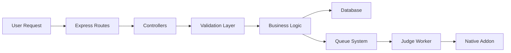

<div align="center">

# 🚀 OAPlateform

### Online Assessment & Practice Platform

_A modern web platform for algorithmic problem-solving, timed assessments, and competitive programming_

[](https://nodejs.org/)
[](https://reactjs.org/)
[](https://www.mongodb.com/)
[](#license--attribution)

[Features](#-project-overview) • [Tech Stack](#-tech-stack) • [Setup](#-deployment--local-setup) • [API](#-api-summary) • [Contributing](#-contributing--code-style)

</div>

---

## 📋 Table of Contents

- [Project Overview](#-project-overview)
- [Tech Stack](#-tech-stack)
- [Repository Structure](#-repository-structure)
- [Frontend Architecture](#-frontend-architecture)
- [Backend Architecture](#-backend-architecture)
- [Validation & Native Addon](#-validation--native-addon)
- [API Summary](#-api-summary)
- [Requirements](#-requirements)
  - [Functional Requirements](#functional-requirements)
  - [Non-Functional Requirements](#non-functional-requirements)
- [Software Requirements Specification](#-software-requirements-specification-srs)
- [Development Model & SDLC](#-software-development-model--sdlc)
- [Testing Strategy](#-testing-strategy)
- [Deployment & Local Setup](#-deployment--local-setup)
- [Contributing & Code Style](#-contributing--code-style)
- [License & Contact](#-license--attribution)

---

## 🎯 Project Overview

### Purpose

Provide a full-stack platform for practicing problems, running timed assessments, managing teams, and evaluating code using an integrated online judge.

### Goals

- ⚡ **Low-latency judge** - Fast code execution and evaluation
- 🔒 **Secure timed assessments** - Protected testing environment
- 🎨 **Easy-to-use UI** - Intuitive and responsive interface
- 👥 **Role-based admin features** - Granular access control
- 📊 **Realtime dashboards** - Live updates and statistics

---

## 🛠 Tech Stack

<table>
<tr>
<td width="50%">

### Frontend

- **Framework:** React (JSX) + Vite
- **Styling:** Tailwind CSS
- **Animations:** Framer Motion
- **Icons:** Lucide React

</td>
<td width="50%">

### Backend

- **Runtime:** Node.js + Express
- **Database:** MongoDB (Mongoose)
- **Queue:** Redis / Internal queue
- **Realtime:** Socket.io

</td>
</tr>
<tr>
<td width="50%">

### Validation & Judge

- **Validation:** Zod schemas
- **Native Addon:** Node Addon API
- **File Hosting:** Cloudinary

</td>
<td width="50%">

### Tools

- **Package Manager:** pnpm (recommended)
- **Node Version:** 18+ LTS
- **Deployment:** Docker-ready

</td>
</tr>
</table>

### 🔍 Why Zod & Node Addon API?

| Technology         | Purpose                     | Benefits                                                              |
| ------------------ | --------------------------- | --------------------------------------------------------------------- |
| **Zod**            | Runtime input validation    | TypeScript-like schemas, reduces runtime errors, improves reliability |
| **Node Addon API** | Native-level code execution | High-performance judge, better sandboxing, faster compile/run cycles  |

---

## 📁 Repository Structure

```
📦 oaplateform/
┣ 📂 Backend/
┃ ┣ 📜 package.json
┃ ┣ 📜 server.js
┃ ┣ 📂 src/
┃ ┃ ┣ 📂 controllers/      # Express controllers (problem, auth, admin, dashboard)
┃ ┃ ┣ 📂 middleware/       # Auth middleware, admin checks
┃ ┃ ┣ 📂 models/           # Mongoose models (User, Problem, Submission, Assessment, Team)
┃ ┃ ┣ 📂 lib/              # Queue, socket, cloudinary helpers, db connector, utils
┃ ┃ ┣ 📂 routes/           # API route definitions
┃ ┃ ┗ 📜 index.js
┃ ┗ 📂 node_native/        # Native addon source (C++/Rust) for judge
┣ 📂 public/               # Static assets (logo.png, favicon, images)
┣ 📂 src/                  # Frontend (React + Vite)
┃ ┣ 📜 App.jsx
┃ ┣ 📜 main.tsx
┃ ┣ 📜 index.css
┃ ┣ 📂 components/         # UI components (Navbar, Footer, etc.)
┃ ┣ 📂 pages/              # Page components (Home, Practice, Dashboard, etc.)
┃ ┣ 📂 context/            # React contexts (AuthContext, ThemeContext)
┃ ┗ 📂 assets/
┣ 📜 package.json
┣ 📜 pnpm-lock.yaml
┗ 📜 README.md
```

> 💡 **Note:** This repo uses `pnpm` - adjust commands if using `npm` or `yarn`

---

## 🎨 Frontend Architecture

### Responsibilities

- UI for browsing/solving problems, timed assessments, and authentication
- API communication via `fetch` with cookie-based auth
- Centralized auth management through `AuthContext`

### Key Pages & Components

| Component     | Path                        | Purpose                              |
| ------------- | --------------------------- | ------------------------------------ |
| **Practice**  | `src/pages/Practice.jsx`    | Browse and filter problems           |
| **Dashboard** | `src/pages/Dashboard.jsx`   | User stats, submissions, contests    |
| **Compiler**  | `src/pages/compiler.jsx`    | Code editor and submission interface |
| **Navbar**    | `src/components/Navbar.jsx` | Top navigation with logo             |

---

## ⚙️ Backend Architecture

### Core Responsibilities



### Key Modules

#### 🔐 Authentication

- Registration, login, cookie-based sessions
- JWT/cookie refresh flows
- Routes: `src/routes/auth.routes.js`

#### 📝 Problem & Assessment Management

- CRUD operations for problems, assessments, MCQs
- Private problem access control
- Controllers: `src/controllers/problem.controller.js`

#### 🏃 Submission Handling

1. Accept code submissions
2. Enqueue to job queue (`src/lib/queue.js`)
3. Process via worker with native addon
4. Return results via socket

#### 🔴 Realtime Updates

- Socket.io integration for live status updates
- Helper: `src/lib/socket.js`

### Security & Validation

✅ All inputs validated with Zod schemas  
✅ Sanitized user content  
✅ Isolated code execution environment

---

## 🔒 Validation & Native Addon

### Zod Validation

Declarative schemas ensure type safety and input validation before controller execution.

### Native Addon (Online Judge)

The judge worker uses a compiled native addon via Node Addon API:

**Responsibilities:**

- 🏗️ Create isolated runtime for code execution
- ⚡ Fast binary interfaces for process management
- 🔒 Fine-grained resource control and sandboxing
- 🔗 N-API bindings for Node integration

**Implementation Notes:**

- Must be compiled per-platform (Linux/Windows/macOS)
- Provide prebuilt binaries for deployments
- Strict timeouts, memory limits, and process isolation
- Consider containerization for additional security

---

## 🌐 API Summary

### Authentication Endpoints

| Method | Endpoint           | Description               |
| ------ | ------------------ | ------------------------- |
| `POST` | `/api/auth/login`  | User login (cookie-based) |
| `POST` | `/api/auth/signup` | User registration         |
| `POST` | `/api/auth/logout` | User logout               |

### Problem & Submission Endpoints

| Method | Endpoint                         | Description                |
| ------ | -------------------------------- | -------------------------- |
| `GET`  | `/api/problem/allProblem`        | List all public problems   |
| `GET`  | `/api/problem/getProblem/:id`    | Get problem details        |
| `POST` | `/api/problem/submitProblem/:id` | Submit code for evaluation |
| `GET`  | `/api/problem/submissions`       | List user submissions      |
| `POST` | `/api/problem/submitMcq`         | Submit MCQ response        |

### Dashboard & Admin

| Method | Endpoint                       | Description                |
| ------ | ------------------------------ | -------------------------- |
| `GET`  | `/api/dashboard/problemSolved` | Aggregated user statistics |
| `*`    | `/api/admin/*`                 | Admin management routes    |

---

## 📊 Requirements

### Functional Requirements

| ID      | Requirement          | Description                           |
| ------- | -------------------- | ------------------------------------- |
| **FR1** | User Management      | Secure registration and login         |
| **FR2** | Problem Browser      | Filter by difficulty and topic        |
| **FR3** | Code Editor          | Edit, run, and submit code            |
| **FR4** | Timed Assessments    | Registration and team support         |
| **FR5** | MCQ Support          | Multiple choice questions and scoring |
| **FR6** | Admin Panel          | CRUD for problems and assessments     |
| **FR7** | Realtime Updates     | Live submission status via sockets    |
| **FR8** | History & Scoreboard | View submissions and team rankings    |

### Non-Functional Requirements

| ID       | Category        | Requirement                                                          |
| -------- | --------------- | -------------------------------------------------------------------- |
| **NFR1** | Performance     | Process submissions within time limits, horizontal scaling           |
| **NFR2** | Security        | Sandboxed code execution, strict resource limits, input sanitization |
| **NFR3** | Reliability     | Retry logic, durable queue for submissions                           |
| **NFR4** | Usability       | Responsive UI, clear errors, accessible forms                        |
| **NFR5** | Maintainability | Modular codebase, documented APIs, schema validation                 |
| **NFR6** | Portability     | Cross-platform support, container-friendly                           |

---

## 📄 Software Requirements Specification (SRS)

### Summary

**Purpose:** Document system behavior and constraints for OAPlateform

**Scope:** Web-based platform for practice & timed assessments with code evaluation

**Actors:**

- 👨‍🎓 Users (students)
- 👨‍💼 Admins
- ⚖️ Judges (workers)
- ☁️ External services (Cloudinary)

### System Features

- Account management
- Problem and contest browsing
- Code editor + judge submission pipeline
- Team/registration management
- Admin management UI and APIs

### External Interfaces

| Interface | Technology     | Purpose          |
| --------- | -------------- | ---------------- |
| Database  | MongoDB        | Data persistence |
| Storage   | Cloudinary     | Media uploads    |
| Queue     | Redis/Local    | Job distribution |
| Judge     | Node Addon API | Code execution   |

### Performance Requirements

- Support **N** concurrent users
- Process **X** submissions/minute under target infrastructure

### Security Requirements

- ✅ Protected endpoints with auth/authorization
- ✅ Escaped user content and sanitized uploads
- ✅ Isolated judge environment (native sandbox + OS process isolation)

### Reliability

- Persisted queue and status updates prevent lost jobs
- Automatic retry on transient failures

### Constraints & Assumptions

- Native addon must be compiled for production environment
- MongoDB instance must be reachable from backend
- Prebuilt binaries or documented build step required

---

## 🔄 Software Development Model & SDLC

### Recommended Model: **Agile (Scrum/Iterative)**

**Reasons:**

- 🔁 Frequent changes expected for problems, judge tuning, UI improvements
- 📦 Iterative sprints enable progressive feature delivery
- 🤝 Regular feedback loops with stakeholders

### Development Cycle

```
Plan → Design → Implement → Test → Deploy → Monitor
```

### Suggested Artifacts

- 📋 Product backlog (issues)
- 🎯 Sprint backlog
- 🔧 CI pipeline
- ✅ Automated tests
- 👀 Code reviews

### Sprint Cadence & Roles

**Sprint Duration:** 2 weeks

**Roles:**

- Product Owner
- Scrum Master
- Developers (Frontend, Backend, Native)
- QA Engineer
- DevOps Engineer

---

## 🧪 Testing Strategy

### Test Types

| Type                  | Scope                                | Tools/Approach      |
| --------------------- | ------------------------------------ | ------------------- |
| **Unit Tests**        | Business logic, controllers, schemas | Jest, Mocha         |
| **Integration Tests** | API endpoints, database operations   | Supertest, test DB  |
| **E2E Tests**         | Complete user flows                  | Cypress, Playwright |
| **Load Tests**        | Judge throughput, concurrent users   | k6, Artillery       |
| **Security Tests**    | Sandbox escapes, input fuzzing       | Custom scripts      |

### Key Test Flows

- ✅ Signup → Login → Submit → View Result
- ✅ Admin CRUD operations
- ✅ Concurrent submission processing
- ✅ Socket connection and updates

---

## 🚀 Deployment & Local Setup

### Prerequisites

- ✅ Node.js LTS (>= 18)
- ✅ pnpm (recommended) or npm/yarn
- ✅ MongoDB instance (local or cloud)
- ✅ Redis (optional, for queue)
- ✅ Build toolchain for native addon (C++ compiler / node-gyp)

### Local Development

#### 1️⃣ Backend Setup

```bash
cd Backend
pnpm install

# Create .env file (copy .env.example if present)
# Set PORT, MONGO_URI, and CLOUDINARY credentials

node server.js
```

#### 2️⃣ Frontend Setup

```bash
# From repo root
pnpm install
pnpm dev
```

#### 3️⃣ Native Addon (Judge)

```bash
# If native code lives in Backend/node_native/
cd Backend/node_native
node-gyp rebuild
# Or follow specific build instructions
```

### Environment Variables

Create a `.env` file in the Backend directory:

```env
PORT=4000
MONGO_URI=mongodb://localhost:27017/oaplateform
JWT_SECRET=your_secret_key_here
CLOUDINARY_URL=cloudinary://...
# Or individual Cloudinary keys
CLOUDINARY_CLOUD_NAME=...
CLOUDINARY_API_KEY=...
CLOUDINARY_API_SECRET=...

# Optional
JUDGE_BINARY_PATH=...
NATIVE_ADDON_PATH=...
```

### CI/CD & Production Recommendations

| Area             | Recommendation                              |
| ---------------- | ------------------------------------------- |
| **Native Addon** | Build in CI or use prebuilt artifacts       |
| **Containers**   | Docker for backend and worker processes     |
| **Scaling**      | Horizontal scale worker pool for judge load |
| **Monitoring**   | Prometheus/Grafana + ELK stack              |
| **Deployment**   | Blue-green or canary deployments            |

---

## 🤝 Contributing & Code Style

### Contribution Guidelines

1. 🌿 Use feature branches for development
2. 🔍 Run linting and tests before PR
3. 📝 Document new API endpoints
4. 🔄 Update README when adding features
5. ✅ Ensure all tests pass

### Pull Request Process

```
Create branch → Develop → Lint & Test → PR → Review → Merge
```

### Code Style

- Follow ESLint configuration
- Use Prettier for formatting
- Write meaningful commit messages
- Add JSDoc comments for functions

---

## 📄 License & Attribution

This project is open source. Add your preferred license file (MIT / Apache-2.0 or your choice).

---

## 📞 Contact / Maintainers

**Project Owner:** [Add your name/contact]

**Repository:** `c:\Users\visha\Downloads\oaplateform\oaplateform`

---

<div align="center">

### 🌟 Made with ❤️ for the coding community

**Questions?** Open an issue • **Want to contribute?** Fork and PR

</div>
